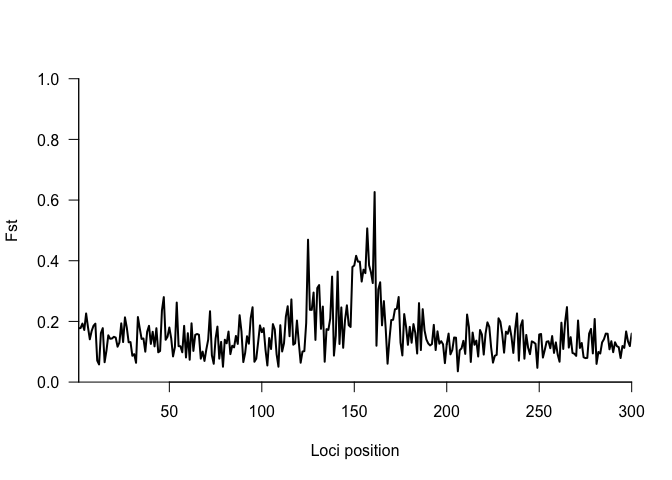
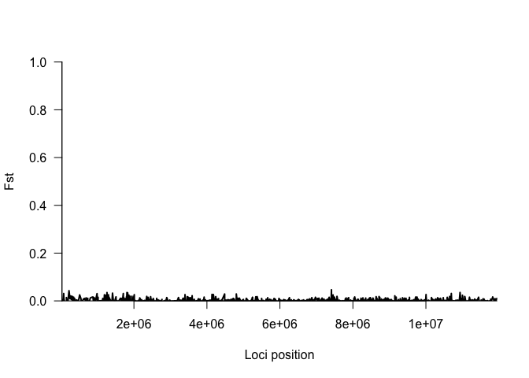

glads — genomic landscape of divergence simulation
================

[](https://zenodo.org/badge/latestdoi/69031005)

This is an R package with a number of functions to allow users to build
up forward-in-time simulations to explore the dynamics of diverging
genomes under various scenarios of gene flow, selection and
genotype-phenotype maps.

It has been written by Claudio S. Quilodrán, Eric C. Anderson, and Tim
Coulson. The details of it appear in a manuscript submitted to *Methods
in Ecology and Evolution* entitled, “The multiple population genetic and
demographic routes to islands of genomic divergence.”

To use it, you must:

1.  Within R, make sure the following packages are installed:
    
    ``` r
    dplyr,
    magrittr,
    pegas,
    progress,
    Rcpp (>= 0.12.7),
    readr
    ```

2.  On your Unix terminal, clone this repository from GitHub, then build
    and install it:
    
    ``` sh
    git clone https://github.com/eriqande/glads
    R CMD INSTALL --no-multiarch --with-keep.source glads
    ```

If you prefer, after cloning it from GitHub, you can open the RStudio
project (`glads/glads.Rproj`) within it and build and install by using
the “Install and Restart” button within RStudio.

Full documentation for the package can be found with:

``` r
help(package = "glads")
```

After that, to see examples of its use, you can run through the examples
in `R-examples/Example1.R` and `R-examples/Example2.R` within the
`glads` repository.

In fact, we will mirror `R-examples/Example1.R`
here:

## R-examples/Example1.R

### Preamble and loading library

``` r
#--------------------------------------------------------------------------------------------
#--------------------------------------------------------------------------------------------
#
#                      Examples for submitted manuscript:
# The many population genetic and demographic routes to islands of genomic divergence
#
# Example 1. Selection: recombination map and fitness function
# Example 2. Neutral evolution: Mutation rate, average recombination, biallelic SNPs,
#                               without fitness function.
# Questions to:
# Claudio S. Quilodrán. Department of Zoology, University of Oxford.
#         Email: claudio.quilodran@zoo.ox.ac.uk; claudio.quilodran@unige.ch
# Eric C. Anderson. Department of Ecology and Evolutionary Biology, University of California.
#         Email: eric.anderson@noaa.gov
#--------------------------------------------------------------------------------------------
#--------------------------------------------------------------------------------------------
library(glads)
```

### Setting the parameters for the first example: recombination map with fitness function

``` r
#################################
##   Example 1: see Table 1    ##
##      recombination map,     ##
##      with fitness function  ##
#################################
########################
### Generating data  ###
########################
initial.population.size=400 #Initial population size
n.loci=300                  #Number of loci
n.alleles.per.locus=20      #Number of alleles

set.seed(2)
start.1 <- start.2 <- initial.struct(initial.population.size,n.loci,n.alleles.per.locus)
start <- list(start.1, start.1) #Initial populations


###################
### Parameters  ###
###################
loci.pos=1:n.loci           #Loci position
add.loci=50                 #Number of additive loci
fitness.pos <- 125:(125+(add.loci-1))   #Additive loci position
sex.ratio <- 0.5

bvs = t(array( seq(0,1, length = n.alleles.per.locus) ,c(n.alleles.per.locus, add.loci))) #Breeding value of additive loci
e.v=0.01                    #Stochastic environmental variant
d.v=1                       #Stochastic demographic variant
n.gens=100                  #Number of generations

recom.map= c(rep(0.5, 299)) #Recombination map
Linked<-c(60:69, 150:159, 230:239) #Linked loci
recom.map[Linked]<-0.0001   #Recombination map with linked loci

#b0 Maximum generated offspring
#b1 Phenotypic optima
#b2 Variance of the fitness curve
#b3 Density-dependent demographic variant
##Parameters of the fitness function
param.w1 <- list(b0 = 6,b1 = 0.25, b2 = 0.5, b3 = 0.01, d.v = d.v, add.loci = add.loci)
param.w2 <- list(b0 = 6,b1 = 0.75, b2 = 0.5, b3 = 0.005, d.v = d.v, add.loci = add.loci)

##Parameters of the phenotype function
param.z1 <- list(sex.ratio, fitness.pos, bvs, add.loci, e.v)
param.z2 <- param.z1
```

### Doing the simulation

``` r
###################
### Simulations ###
###################

example <- evolve(
  x = start, 
  time = n.gens, 
  type = "additive", 
  recombination = "map", 
  recom.rate = recom.map, 
  param.z = list(param.z1, param.z2), 
  param.w = list(param.w1, param.w2)
  )
```

### Computing Fst at the markers

``` r
###################
###     Fst     ###
###################
##Commputation of Fst values
#We should first convert the output from class 'struct' to class 'loci'

example.loci <- struct2pegas(example)

#Estimating Fst with library 'pegas'
FST <- pegas::Fst(example.loci)
```

### Plotting the results

``` r
#Figure
plot(loci.pos, FST[,"Fst"], pch=16, bty="l", xlab="Loci position", ylab="Fst", ylim=c(0,1), type="l", xaxs="i", yaxs="i", las=1, lwd=2  )
```

<!-- -->

### Doing all of the second example: mutation rate, average recombination, biallelic SNPs, without fitness function

``` r
#################################
##   Example 2: Mutation rate, ##
##     average recombination,  ##
##         biallelic SNPs      ##
##   without fitness function  ##
#################################
########################
### Generating data  ###
########################
Nind = 200  #Number of individuals
Nsnp = 1000 #Number of SNPs
n.alleles = 2

#Random genetic identity
set.seed(1)
start.1 <- start.2 <- initial.struct(Nind, Nsnp, n.alleles)

###################
### Parameters  ###
###################
loci.pos<-sort(sample(1:12000000, 1000, replace=F) ) #Loci position
chromo_mb<-12000000      #Chromosome size

sex.ratio = 0.5              #Sex ratio
mean.fitness = 3             #Offspring per breeding pair
crossover <- 1.0/100000000.0     #Average recombination rate (cM/MB)
mutation.rate=1.1*10^-8      #Mutation per site per generation
n.gens=100                   #Number of generations
migration.rate=0.075         #Migration rate
d.d=0.005                    #Demographic effect to avoid exponential growth

param.z0 <- list(sex.ratio = sex.ratio)
param.w0 <- list(mean.fitness = mean.fitness, d.d = d.d)


###################
### Simulations ###
###################

example2 <- evolve(
  x = list(start.1, start.2), 
  time = n.gens, 
  type = "dynamic", 
  recombination = "average", 
  recom.rate = crossover,
  migration.rate = migration.rate, 
  mutation.rate = mutation.rate, 
  loci.pos = loci.pos, 
  chromo_mb = chromo_mb, 
  param.z = list(param.z0, param.z0), 
  param.w = list(param.w0, param.w0)
  )


###################
###     Fst     ###
###################
##Commputation of Fst values
#We should first convert the output from class 'struct' to class 'loci'

example.loci2 <- struct2pegas(example2)

#Estimating Fst with library 'pegas'
FST <- pegas::Fst(example.loci2)

#Figure
plot(loci.pos, FST[,"Fst"], pch=16, bty="l", xlab="Loci position", ylab="Fst", ylim=c(0,1), type="l", xaxs="i", yaxs="i", las=1, lwd=2  )
```

<!-- -->
